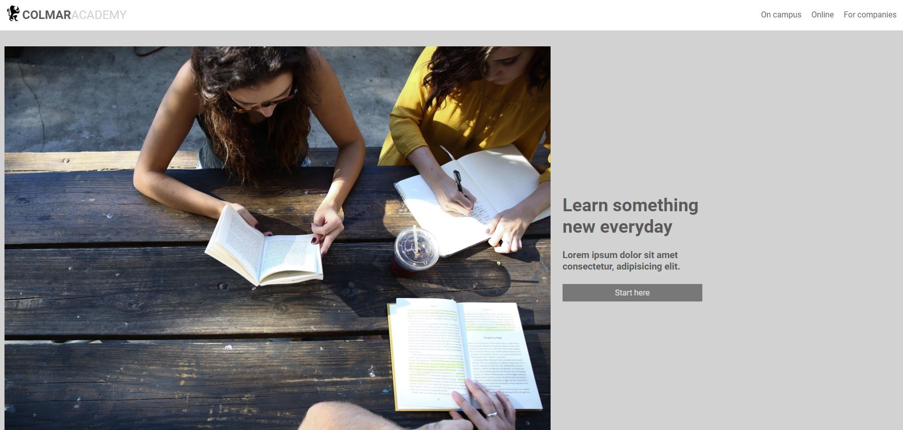

# Calmor Academy

## Table of contents

- [Overview](#overview)
  - [The challenge](#the-challenge)
  - [Screenshot](#screenshot)
  - [Links](#links)
- [My process](#my-process)
  - [Built with](#built-with)
  - [What I learned](#what-i-learned)
  - [Continued development](#continued-development)
- [Author](#author)

## Overview

### The challenge

Users should be able to:

- View the optimal layout for the app depending on their device's screen size
- See hover states for all interactive elements on the page

### Screenshot

### Links

- Live Site URL: [View](https://camkol.github.io/capstone_colmar_assets/)

## My process

- This project served as my CSS capstone project.
- Introducing SASS into the mix, I found it beneficial for visual structure.
- Initially grappling with Flexbox, I decided to take a break and reacquaint myself with it. This approach led to an improved comprehension of grid layout techniques.
- With the desktop view finalized, I delved into crafting a responsive design.
- Out of habit, and for reliable sourcing, I ensured that even when provided with media links, I extracted photos and videos to the project folder.

### Built with

- Semantic HTML5 markup
- CSS custom properties
- [Sass](https://sass-lang.com/) - Preprocessor scripting language
- Flexbox
- CSS Grid
- Mobile-Responsive Design

### What I learned

This was a capstone project from the css course. I was able to really develop my design skills here.

### Continued development

I will probably use this as a template for future projects.

## Author

- Website - [Cameron Howze](https://camkol.github.io/)
- Frontend Mentor - [@camkol](https://www.frontendmentor.io/profile/camkol)
- GitHub- [@camkol](https://github.com/camkol)
- LinkedIn - [@cameron-howze](https://www.linkedin.com/in/cameron-howze-28a646109/)
- E-Mail - [cameronhowze4@outlook.com](mailto:cameronhowze4@outlook.com)
